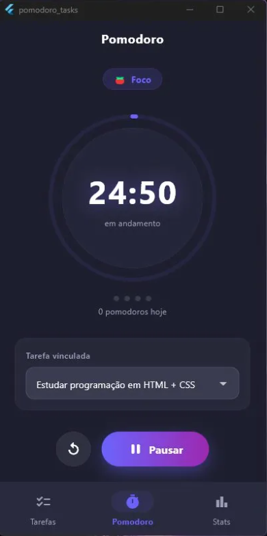
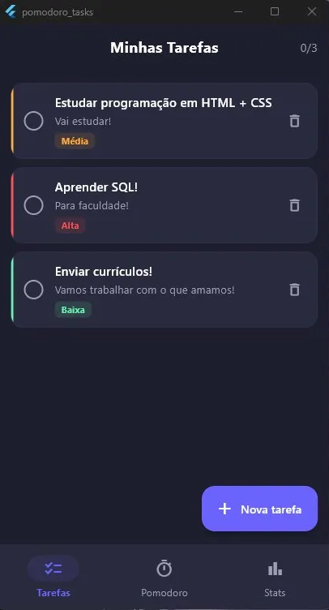

# 🍅 Pomodoro Tasks

Aplicativo de gerenciamento de tarefas com timer Pomodoro integrado, desenvolvido em Flutter com Clean Architecture, design glassmorphism e dark mode.


---

## 📸 Screenshots

<p align="center">
  
  &nbsp;&nbsp;
  
  &nbsp;&nbsp;
  
</p>

<p align="center">
  <em>Tarefas &nbsp;&nbsp;&nbsp;&nbsp;&nbsp;&nbsp;&nbsp;&nbsp;&nbsp;&nbsp;&nbsp;&nbsp;&nbsp;&nbsp;&nbsp;&nbsp; Pomodoro &nbsp;&nbsp;&nbsp;&nbsp;&nbsp;&nbsp;&nbsp;&nbsp;&nbsp;&nbsp;&nbsp;&nbsp;&nbsp;&nbsp;&nbsp;&nbsp; Estatísticas</em>
</p>

---

## 📱 Funcionalidades

- ✅ **Gerenciamento de tarefas** — crie, conclua e delete tarefas com título, descrição e prioridade (alta, média, baixa)
- ⏱️ **Timer Pomodoro** — ciclos automáticos de foco (25min), pausa curta (5min) e pausa longa (15min)
- 🔗 **Vínculo tarefa-pomodoro** — vincule um pomodoro a uma tarefa e acompanhe quantos ciclos foram dedicados a ela
- 📊 **Estatísticas** — gráfico de barras semanal, resumo de tarefas criadas/concluídas e ranking de foco por tarefa
- 🔔 **Notificações locais** — alerta ao fim de cada sessão Pomodoro
- 💾 **Persistência local** — todos os dados salvos no dispositivo com Hive, sem necessidade de internet
- 🎨 **Design glassmorphism** — interface dark mode com efeito de vidro fosco e paleta roxo + cinza

---

## 🏗️ Arquitetura

O projeto segue os princípios da **Clean Architecture**, dividido em 3 camadas independentes:

```
Presentation  →  Domain  →  Data
   (UI)        (Regras)   (Persistência)
```

- **Domain** — entidades puras (`Task`, `PomodoroSession`) e interface do repositório (`TaskRepository`). Sem dependência de frameworks externos.
- **Data** — implementação concreta do repositório, modelos Hive (`TaskModel`, `PomodoroSessionModel`) e datasource local.
- **Presentation** — telas Flutter, providers Riverpod e widgets. Consome apenas o Domain.

---

## 📁 Estrutura de pastas

```
lib/
├── main.dart
├── core/
│   └── theme.dart
├── domain/
│   ├── entities/
│   │   ├── task.dart
│   │   └── pomodoro_session.dart
│   └── repositories/
│       └── task_repository.dart
├── data/
│   ├── datasources/
│   │   ├── hive_datasource.dart
│   │   └── notification_service.dart
│   ├── models/
│   │   ├── task_model.dart
│   │   └── pomodoro_session_model.dart
│   └── repositories/
│       └── task_repository_impl.dart
└── presentation/
    ├── providers/
    │   ├── task_provider.dart
    │   └── pomodoro_provider.dart
    └── screens/
        ├── tasks_screen.dart
        ├── pomodoro_screen.dart
        └── stats_screen.dart
```

---

## 🛠️ Tecnologias e pacotes

| Pacote                                                                              | Uso                             |
| ----------------------------------------------------------------------------------- | ------------------------------- |
| [flutter_riverpod](https://pub.dev/packages/flutter_riverpod)                       | Gerenciamento de estado reativo |
| [hive_flutter](https://pub.dev/packages/hive_flutter)                               | Banco de dados local NoSQL      |
| [fl_chart](https://pub.dev/packages/fl_chart)                                       | Gráficos de estatísticas        |
| [flutter_local_notifications](https://pub.dev/packages/flutter_local_notifications) | Notificações ao fim do timer    |
| [go_router](https://pub.dev/packages/go_router)                                     | Navegação declarativa           |
| [uuid](https://pub.dev/packages/uuid)                                               | Geração de IDs únicos           |

---

## 🚀 Como rodar o projeto

### Pré-requisitos

- [Flutter SDK](https://docs.flutter.dev/get-started/install) 3.x ou superior
- [Dart SDK](https://dart.dev/get-dart) 3.x ou superior
- Para Windows: Visual Studio com a carga de trabalho **Desenvolvimento para desktop com C++**

### Passos

```bash
# 1. Clone o repositório
git clone https://github.com/seu-usuario/pomodoro_tasks.git
cd pomodoro_tasks

# 2. Instale as dependências
flutter pub get

# 3. Gere os arquivos do Hive
dart run build_runner build --delete-conflicting-outputs

# 4. Rode o app
flutter run
```

---

## 📐 Decisões técnicas

**Por que Riverpod?**
Escolhido por oferecer providers tipados, testáveis e sem dependência de `BuildContext`, facilitando a separação entre lógica e UI.

**Por que Hive?**
Banco NoSQL local com excelente performance para Flutter, sem necessidade de escrever SQL e com suporte a objetos Dart nativos via geração de código.

**Por que Clean Architecture?**
Permite que as regras de negócio (Domain) sejam completamente independentes do framework e da camada de dados, tornando o código mais testável e fácil de manter.

---

## 🎓 Contexto

Projeto desenvolvido para portfólio e como trabalho acadêmico, aplicando conceitos de:

- Arquitetura de software (Clean Architecture)
- Gerenciamento de estado reativo
- Persistência local de dados
- Desenvolvimento multiplataforma com Flutter

---

## 📄 Licença

Este projeto está sob a licença MIT. Veja o arquivo [LICENSE](LICENSE) para mais detalhes.
